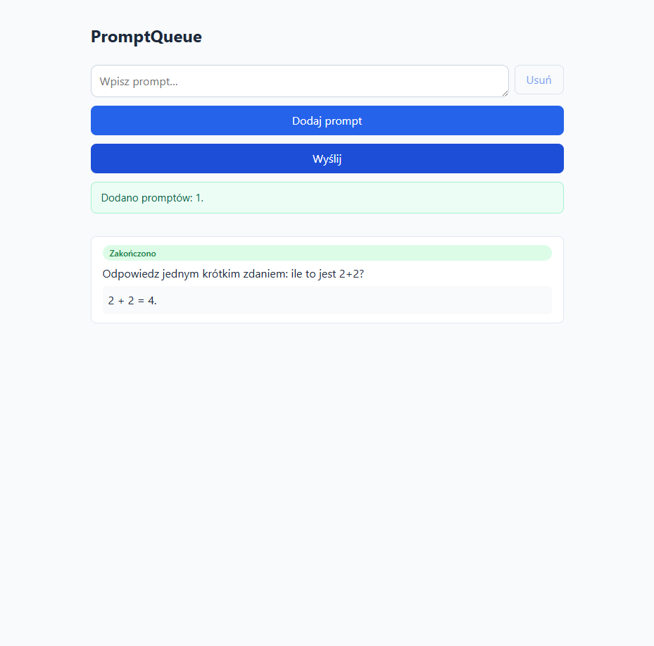

# Weryfikacja end-to-end: pq-6 — pełny `docker compose up`

> Data: 2026-07-15
> Zakres: DoD pq-6 — „jedno polecenie stawia całość; UI działa i rozmawia z Api; Worker przetwarza prompty przez Ollamę"
> Metoda: realny `docker compose build && docker compose up` na tej maszynie + sterowanie przeglądarką (Playwright) przez faktycznie uruchomiony stos (nie testy jednostkowe, nie mocki)

## Środowisko

- `docker compose build` → wszystkie 3 obrazy (`api`, `worker`, `frontend`) zbudowane bez błędu (potwierdza fix `backend/.dockerignore`).
- `docker compose up -d` → wszystkie usługi wstały; `ollama-pull` (pobranie modelu `llama3.2`, ~2 GB) zakończył się `exit 0`.
- Wszystkie healthchecki `healthy`: `postgres`, `api`, `ollama`.

## Krok 1 — kolejność startu / gotowość schematu

Worker wstał dopiero po `api: healthy` i `ollama-pull: completed_successfully`, zgodnie z bramkami w `docker-compose.yml`. Log workera:

```
info: PromptQueue.Worker.PromptProcessingWorker[0]
      PromptProcessingWorker started.
info: Microsoft.Hosting.Lifetime[0]
      Application started. Press Ctrl+C to shut down.
info: PromptQueue.Worker.PromptProcessor[0]
      Model endpoint is ready.
```

**„Model endpoint is ready."** potwierdza, że Worker połączył się z `ollama:11434` (nazwa usługi w sieci compose) — dowód, że fix precedencji konfiguracji (`AddEnvironmentVariables()` w `Program.cs`, naprawiający BLOKER z krytyki projektu) faktycznie działa w kontenerze. Bez tego fixu Worker próbowałby nieosiągalnego `localhost:11434` i wisiałby w `WaitForModelAsync` w nieskończoność.

Nieszkodliwa obserwacja w logu: `Cannot load library libgssapi_krb5.so.2` — znany, łagodny warning Npgsql przy próbie negocjacji GSSAPI na okrojonym obrazie `.NET runtime` (brak biblioteki Kerberos); Npgsql automatycznie przechodzi na zwykłe uwierzytelnienie, połączenie z bazą działa (potwierdzone dalszym przebiegiem).

## Krok 2 — happy path: front → Api → Worker → Ollama → front

Otwarto `http://localhost:8080` (frontend, nginx, produkcyjny build). Dodano prompt: *„Odpowiedz jednym krótkim zdaniem: ile to jest 2+2?"*.

- Formularz wysłał `POST /api/v1/prompts` przez nginx-proxy (`/api/*` → `api:8080`) → `200`, alert „Dodano promptów: 1.".
- Lista natychmiast pokazała nowy wpis ze statusem `Oczekuje`, po kilku sekundach `Przetwarzanie`.
- Po ~15 s (realna inferencja `llama3.2` na CPU) status zmienił się na **`Zakończono`** z odpowiedzią modelu: **„2 + 2 = 4."**



To potwierdza pełny łańcuch: frontend (nginx:8080) → nginx-proxy → Api (migracja+schemat) → Postgres → Worker (polling) → Ollama (realna inferencja) → Postgres → polling frontu → UI.

## Krok 3 — probe: ścieżka błędu (Ollama niedostępna)

`docker compose stop ollama`, następnie dodano drugi prompt: *„Drugi prompt testowy przy zatrzymanej Ollamie."*

Wynik: status **`Błąd`** z komunikatem `Resource temporarily unavailable (ollama:11434)`.

Log workera pokazuje pełny stack trace wyjątku `HttpConnectionPool`/`OllamaSharp`, złapany wewnątrz `PromptProcessor.ProcessAsync` (linia 90) — zgodnie z projektem pq-3 (jedno ponowienie, potem `Fail`). Kontener `promptqueue-worker` pozostał **`Up`** przez cały czas testu — wyjątek nie ubił procesu.

`docker compose start ollama` przywrócił usługę.

## Wnioski

| Kryterium DoD | Wynik |
|---|---|
| Jedno polecenie (`docker compose up`) stawia całość | ✅ |
| Kolejność startu respektuje gotowość schematu i modelu | ✅ (Worker czeka na `api healthy` + `ollama-pull completed`) |
| UI działa i rozmawia z Api | ✅ (przez nginx-proxy, jeden origin, bez CORS) |
| Worker przetwarza prompty przez Ollamę | ✅ (realna odpowiedź modelu zaobserwowana) |
| Błąd modelu nie ubija Workera | ✅ (status `Failed` z komunikatem, proces żywy) |

Środowisko posprzątane po weryfikacji (`docker compose down`, wolumeny z pobranym modelem zachowane — kolejny `up` nie pobiera ponownie ~2 GB).
